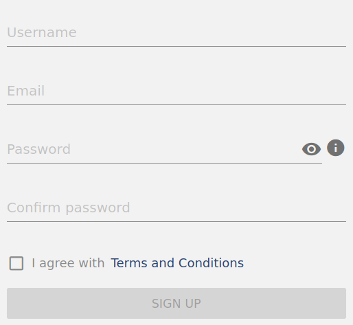
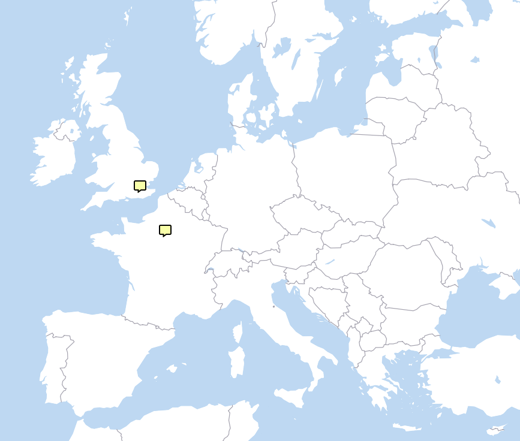
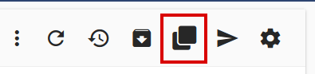

# Getting Started with Mergin

It is easy to start using Mergin - let's head to https://public.cloudmergin.com/

## Sign up

First, you will need an account. Signing up is free: you just need to enter your email address and pick your username and password.

Next, check your email - you will get a mail with activation link for your account.
After you click the link to confirm your email address, you are ready to log in.

**Note:** One can view and download public projects even without an account, but creation of projects
and synchronization of geo-data only works when you are logged in.

## Explore Mergin service

All data in Mergin are stored in **projects**. A project normally contains a QGIS project file
and geo-data linked from it (such as GeoPackage and/or GeoTIFF files). It may contain also extra
media files (such as pictures) or any other data files you need.

Setting up a project can take a bit of time, so for this introduction we will start from an existing
project and we will show how to set up your own project later.

Head to [lutraconsulting / Basic survey](https://public.cloudmergin.com/projects/lutraconsulting/Basic%20survey/tree)
project in Mergin. This a very simple project with a background map and a point layer for notes.
When you open the link above, the project page will come up with a list of files within the project:

You can see there is a QGIS project file (project.qgz), a GeoPackage with the survey layer (survey.gpkg)
and a few more files. When loaded in QGIS, the project looks like this:

(The map uses online vector tiles for background mapping, all styling is configured in project.qgz file.)

If we wanted to do any modifications to the project, we won't be able to upload the changes back to the cloud
because we do not have write permissions to the project. We can however create our own copy of the project:
one of the buttons in the project page will clone the project:

Click the button, pick a project name (it can stay the same - "Basic survey"), select your user name as the namespace
and finally click the Clone button. In a few seconds, your project is ready! Now you are owner of the project
and thus you can modify it.

Now let's see how we can use the project in QGIS and in the Input app.

## Using your project in Input app

TODO: install input, log in, download project, enjoy!

## Using your project in QGIS

TODO: Open QGIS, install mergin plugin, sign in, download project and enjoy!
