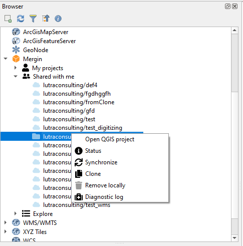
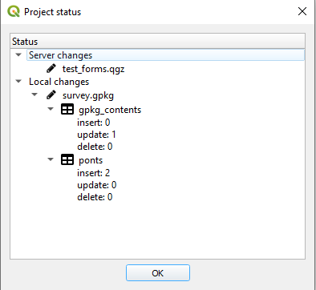
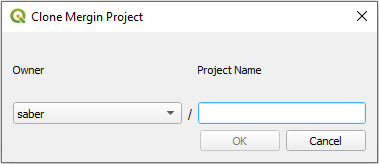

You can make changes to your project and data. The changes can be synchronised back to Mergin. The plugin also presents you with an option to see which layers and files have been changed.

To synchronise the data back to Mergin:

1. Select the Mergin project status from the toolbar or alternatively right-click on the project from the list on your Mergin projects under the Browser panel in QGIS and select **Status**:

	

2. A new window should appear listing the pending changes to be synchronised:

	

    **Note:** In addition to the status of changed files, you can also see detailed changes to your survey layer(s) (GeoPackage) i.e. the number of added, modified and deleted features.

3. Once you confirm the status of changes, you can right-click on the project from the Browser panel under Mergin and select **Synchronize**.

**Note:** Synchronising data and project will work in both ways: all your changes will be uploaded to the server and any pending changes from the server edition of your files will be downloaded and appended to your local files. Therefore, when synchronisation process is completed, your local files and the copy of files on the server will be identical.
