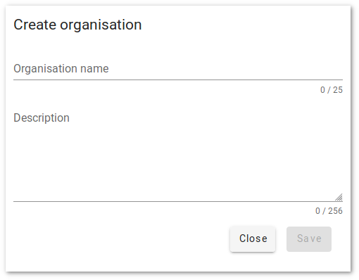

In Mergin, **Organisations** can be used for easier management of users and projects within your team.

Just like ordinary user accounts, organisations can own and manage Mergin projects. All projects listed under an organisation use its
storage quota - rather than consuming storage quota of individual users that have created them.

Another advantage of organisations is that other users
can be invited and they will get access to organisation's projects - it is not necessary to grant or revoke permissions of a single user
manually for each project.

### Creating an Organisation

This section describes how to create an organisation.

1. Log in to Mergin
2. Click the account settings button  in the top-right then click **Your Organisations**

	

3. Click the + button in the top right to add a new organisation

	

4. Enter a name and description of the new organisation and click SAVE

	

	Next you'll need to enter some billing information

5. Click the **Set billing info** button in the top-right

	

6. Fill out your billing information and click CREATE

	

Please note:

* VAT number is optional and only required if you want to use *reverse charge* VAT payments. At this time we are not processing *reverse-charge* VAT payments but will be doing so in the future.
* If a VAT number is entered, this must be associated with the address you enter below.
* The address you enter must match the address registered with your payment method (e.g. credit card)
* The address entered needs to match the address

Next, please notify us (info@lutraconsulting.co.uk) of the name of your new organisation and we will configure your storage.

### Inviting Users

With your organisation now created, you probably want to add users. You can do so by following these steps:

1. On the organisations page we were using above, scroll down to **Invitations**
2. Locate their Mergin **username**, select them and click INVITE

	

Please note this search tool searches on the mergin username only (not on their name).

After clicking INVITE you should get notification that an invite has been sent to them and they should appear in the list of invited memebers. Should they accept your invitation, they will then appear in the members list above where you can change their level of access (e.g. reader, writer).

 A known issue with the invitation process means that users clicking on the invitation activation links emailed to them by Mergin will see an error message if they click the link and are not already logged-in to Mergin.

We therefore recommend notifying users ahead of inviting them, telling them that they will need to be logged-in to Mergin when they click the activation links in their invites to your organisation.

### Next Steps

You can start creating and using projects within the organisation as soon as the storage has been configured for you.
It is also possible to transfer existing Mergin projects from a different user account (and the project storage will
be consumed from the organisation's quota instead of consuming user account's quota, which may be only 100 MB in case the user has free plan).
