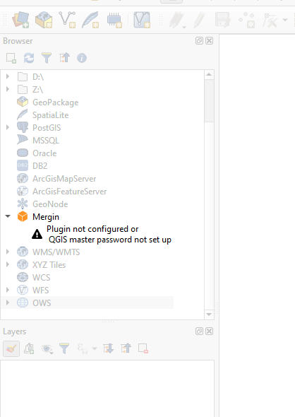
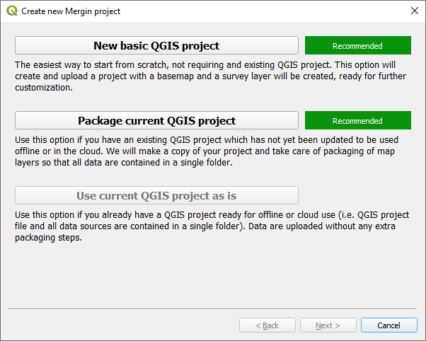
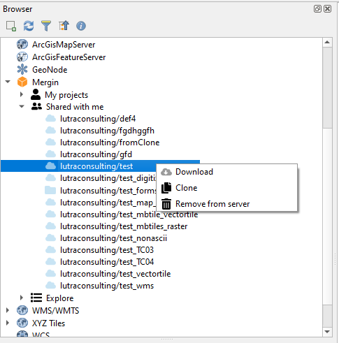
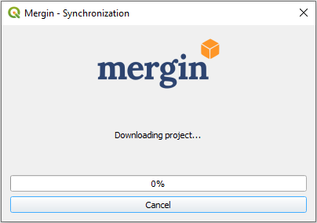
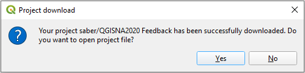
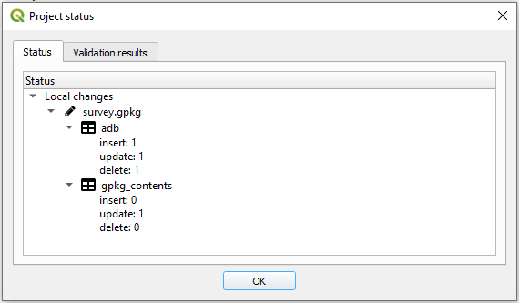

You can manage your Mergin projects from within QGIS through Mergin plugin. The sections below describe how to install, configure, create, upload and synchronise your projects and data from QGIS.

### Installation and configuration

To install Mergin plugin in QGIS:

1. Open QGIS

2. From the main menu, Plugins > Manage and Install Plugins ...

3. A new window will appear:

	3.1 In the **Search** section, type: Mergin

	3.2 Select Mergin in the filtered section and then click **Install Plugin**

4. Once installed, you should see Mergin in your QGIS Browser panel (note that if you are using QGIS 3.12 or earlier you will need to restart your QGIS for Mergin to appear in your browser panel):

	

	**Note:** if you cannot see your Browser panel, you can enable it by going to the QGIS main menu > View > Panels > Browser

5. A new toolbar should also appear in your QGIS toolbars:

After installation, you need to configure the plugin by entering your Mergin username and password:

1. From the QGIS Browser panel, right-click on **Mergin** and select **Configure**
		(alternatively from the Mergin toolbar, select the configure icon )

2. In the new window, type in your username (or email address used for signing up with Mergin) and password

	

You can select to store the password. For that you need to have already configured your [QGIS password manager](https://docs.qgis.org/3.10/en/docs/user_manual/auth_system/auth_overview.html?highlight=password#master-password)

### Creating a new Mergin project

To create a new project, you can start from a blank project or alternatively open an existing project. You can then select **Create Mergin Project** from the toolbar:

A new window will appear which should give you three options (the last two options are available only if you have an existing project open):

- **New basic QGIS project**: if you are new to QGIS, this is a good starting point. With this option, a project will be created. Within the project there will be a survey layer (a point layer) and background map (OpenStreetMap).

- **Package current QGIS project**: this option will create a copy of your project and copies all the files to a single folder. The wizard tries to guess each format and offers users three options to package the layer, keep as is (i.e. the layer will be referenced as is in the new project) or ignore (the layer will not be included in the new project). The default for each layer type is as: the web services (e.g. WMTS, XYZ tiles, vector tile layers) will be referenced in the new project as they are. Vector layers will be all written to Geopackage format (each vector in one Geopackage database). Raster layers will be copied as they are. The layers will be referenced in the new project accordingly.

- **Use current QGIS project as is**: this is for cases when you have already a stand-alone folder with your projects packaged.

In the next window, you will be prompted to assign a project name and select a path where your project folder and associated files will be generated (this option is only available for the first two choices):

After the wizard, the new project will be created locally and on the Mergin server.

### Downloading projects
Once you have configured the plugin with your Mergin credentials, you should be able to see the following sections under the Mergin in your QGIS Browser panel:

* My projects

* Shared with me

* Explore

You can select one of the categories and see the listed projects. To download a project:

1. Right-click on the project and select **Download**

	

2. A new window will appear to save the project under a folder on your PC. Browse to the folder you want to download your project to and click **Select folder**

	

3. Once the download is completed, you will be presented with an option to open the project in QGIS:

	

Selecting **Yes** will open the project and all the associated layers.

### Synchronising project and data

You can make changes to your project and data. The changes can be synchronised back to Mergin. The plugin also presents you with an option to see which layers and files have been changed.

To synchronise the data back to Mergin:

1. Select the Mergin project status from the toolbar or alternatively right-click on the project from the list on your Mergin projects under the Browser panel in QGIS and select **Status**:

	

2. A new window should appear listing the pending changes to be synchronised:

	

    **Note:** In addition to the status of changed files, you can also see detailed changes to your survey layer(s) (GeoPackage) i.e. the number of added, modified and deleted features.

3. Once you confirm the status of changes, you can right-click on the project from the Browser panel under Mergin and select **Synchronize**.

**Note:** Synchronising data and project will work in both ways: all your changes will be uploaded to the server and any pending changes from the server edition of your files will be downloaded and appended to your local files. Therefore, when synchronisation process is completed, your local files and the copy of files on the server will be identical.

### Validation and status check

It is recommended to run the project status after changing your layers and project. This will help getting a list of pending changes and also see any warnings or validations of your project. The warnings are related to restructuring of a Geopackage layer (adding/removing a field or addding/removing a layer in a Geopackage database). Validations can be linked to missing layer or availability of a layer when working offline:

### Cloning an existing project

With the plugin, you can make a copy of one of your existing projects or the ones shared with you. Simply right-click on the project under the **Browser panel > Mergin** and select **Clone**. In the new window, select the **Owner** from the drop-down menu and type your new **Project Name**.

### Deleting a project

You can delete a Mergin project either on your PC (locally) or on the Mergin server. To be able to delete the project on the Mergin server, you need to first delete the files locally.

To delete a project, in the Browser panel, right-click on the project and select **Remove locally**. Once the project is deleted from the PC, you can remove it from the server by right-clicking on the project again and selecting **Remove from server**. Warning: this operation is not undoable and all data in the project will be permanently deleted.

### QGIS variables

The plugin adds several variables that can be used in QGIS expressions:

| Variable name               | Sample value                     | Scope   | Description |
|-----------------------------|----------------------------------|---------|-------------|
| `@mergin_username`          | `martin`                         | global  | Name of the user currently logged in to Mergin |
| `@mergin_url`               | `https://public.cloudmergin.com` | global  | URL of the Mergin service |
| `@mergin_project_name`      | `Tree survey`                    | project | Name of the active Mergin project  |
| `@mergin_project_owner`     | `martin`                         | project | Name of the owner of the active Mergin project |
| `@mergin_project_full_name` | `martin/Tree survey`             | project | Owner and project name joined with a forward slash |
| `@mergin_project_version`   | `42`                             | project | Current version of the active Mergin project |

A common use case is to use `@mergin_username` as the default value for one of the fields in a survey layer to automatically track who has added (and/or modified) a particular record.

### Diagnostic logs
If you experience any issues with syncing data, you can send the logs to the developers for debugging the issues. To send the logs, right-click on a local project under Mergin in the Browser panel and select **Diagnostic logs**. A new window will appear, click **OK** to confirm.
