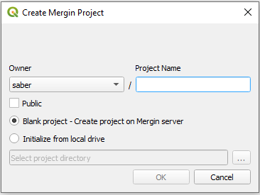
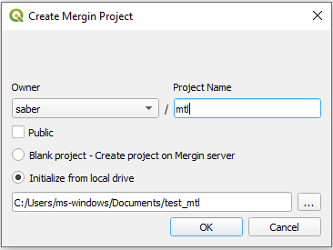

You can manage your Mergin projects from within QGIS through Mergin plugin. The sections below describe how to install, configure, create, upload and synchronise your projects and data from QGIS.

### Installation and configuration

To install Mergin plugin in QGIS:

1. Open QGIS

2. From the main menu, Plugins > Manage and Install Plugins ...

3. A new window will appear:

	3.1 In the **Search** section, type: Mergin

	3.2 Select Mergin in the filtered section and then click **Install Plugin**

4. Once installed, you should see Mergin in your QGIS Browser panel (note that if you are using QGIS 3.12 or earlier you will need to restart your QGIS for Mergin to appear in your browser panel):

	

	**Note:** if you cannot see your Browser panel, you can enable it by going to the QGIS main menu > View > Panels > Browser

After installation, you need to configure the plugin by entering your Mergin username and password:

1. From the QGIS Browser panel, right-click on **Mergin** and select **Configure**

2. In the new window, type in your username (or email address used for signing up with Mergin) and password

	

You can select to store the password. For that you need to have already configured your [QGIS password manager](https://docs.qgis.org/3.10/en/docs/user_manual/auth_system/auth_overview.html?highlight=password#master-password)

### Downloading projects
Once you have configured the plugin with your Mergin credentials, you should be able to see the following sections under the Mergin in your QGIS Browser panel:

* My projects

* Shared with me

* Explore

You can select one of the categories and see the listed projects. To download a project:

1. Right-click on the project and select **Download**

	

2. A new window will appear to save the project under a folder on your PC. Browse to the folder you want to download your project to and click **Select folder**

	

3. Once the download is completed, you will be presented with an option to open the project in QGIS:

	

Selecting **Yes** will open the project and all the associated layers.

### Synchronising project and data

You can make changes to your project and data. The changes can be synchronised back to Mergin. The plugin also presents you with an option to see which layers and files have been changed.

To synchronise the data back to Mergin:

1. Right-click on the project from the list on your Mergin projects under the Browser panel in QGIS and select **Status**:

	

2. A new window should appear listing the pending changes to be synchronised:

	

    **Note:** In addition to the status of changed files, you can also see detailed changes to your survey layer(s) (GeoPackage) i.e. the number of added, modified and deleted features.

3. Once you confirm the status of changes, you can right-click on the project from the Browser panel under Mergin and select **Synchronize**.

**Note:** Synchronising data and project will work in both ways: all your changes will be uploaded to the server and any pending changes from the server edition of your files will be downloaded and appended to your local files. Therefore, when synchronisation process is completed, your local files and the copy of files on the server will be identical.

### Creating a new Mergin project

You can create a new Mergin project using the plugin. The plugin offers two options:

* Create a new blank project: with this option, you can create a new blank project on the Mergin server. You can then download the project locally and move your QGIS files and layers to the downloaded empty folder. Once you have all your data under the local folder, you can then synchronise your project to upload all the new files and layers.

	

* Create a new project from an existing folder: provided that you have all your data and project, you can create the project from an existing local folder:

	

	**Note:** You need to have all your files and layers relative to the project file (the default option in [QGIS](https://docs.qgis.org/3.10/en/docs/user_manual/introduction/qgis_configuration.html#general-properties))

	**Note:** There should be only one QGIS project (qgs or qgz file) within the folder (or subfolders).

### Deleting a project

You can delete a Mergin project either on your PC (locally) or on the Mergin server. To be able to delete the project on the Mergin server, you need to first delete the files locally.

To delete a project, in the Browser panel, right-click on the project and select **Remove locally**. Once the project is deleted from the PC, you can remove it from the server by right-clicking on the project again and selecting **Remove from server**. Warning: this operation is not undoable and all data in the project will be permanently deleted.

### QGIS variables

The plugin adds several variables that can be used in QGIS expressions:

| Variable name               | Sample value                     | Scope   | Description |
|-----------------------------|----------------------------------|---------|-------------|
| `@mergin_username`          | `martin`                         | global  | Name of the user currently logged in to Mergin |
| `@mergin_url`               | `https://public.cloudmergin.com` | global  | URL of the Mergin service |
| `@mergin_project_name`      | `Tree survey`                    | project | Name of the active Mergin project  |
| `@mergin_project_owner`     | `martin`                         | project | Name of the owner of the active Mergin project |
| `@mergin_project_full_name` | `martin/Tree survey`             | project | Owner and project name joined with a forward slash |
| `@mergin_project_version`   | `42`                             | project | Current version of the active Mergin project |

A common use case is to use `@mergin_username` as the default value for one of the fields in a survey layer to automatically track who has added (and/or modified) a particular record.
